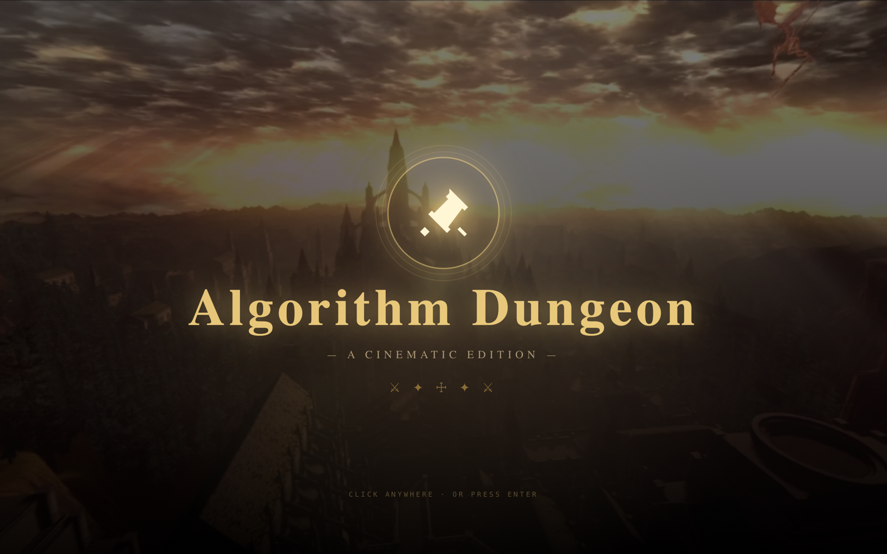
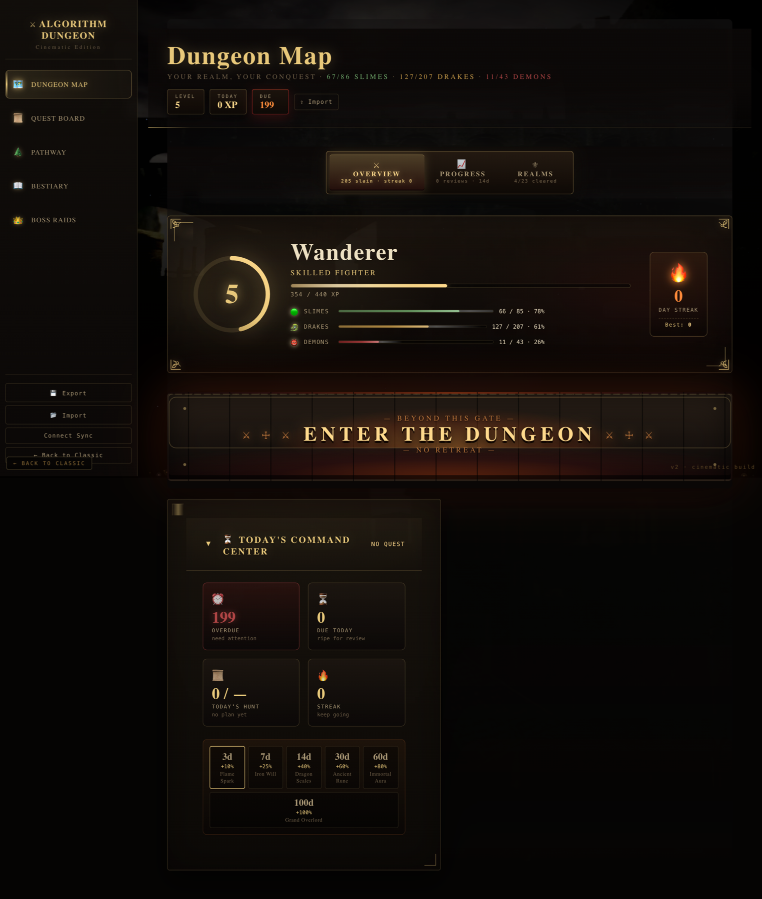
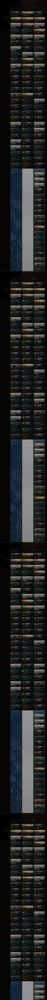
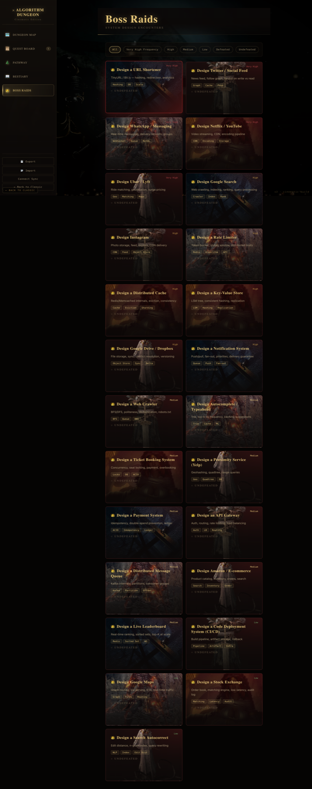

# DSA Dojo

A cinematic, Dark Souls-inspired DSA practice tracker that turns LeetCode problem-solving into an RPG adventure. Problems are monsters, topics are dungeons, and mastery is earned through battle.

**[Live Site](https://heyiamhemant.github.io/DSA_Dojo/)**

> Looking for the original V1 (forest theme)? It now lives at **[DSA_Dojo_legacy](https://github.com/heyiamhemant/DSA_Dojo_legacy)** ([live](https://heyiamhemant.github.io/DSA_Dojo_legacy/)).

## Preview

| Title Screen | Dashboard |
|:-:|:-:|
|  |  |

| Realms of Conquest | Dungeon Pathway |
|:-:|:-:|
|  |  |

| Quest Board | Bestiary |
|:-:|:-:|
|  |  |

| Boss Raids |
|:-:|
|  |

## Features

### Core Game Loop
- **Dungeon Pathway** — A dignified codex-atlas of stone-seal keeps with parallax ramparts, animated fireflies, torch sconces, and per-topic Dark Souls scene art behind every node.
- **Quest Board** — A spaced-repetition engine that generates daily quests. Prioritizes overdue reviews over new problems, gates difficulty progression (no Hard problems until you've built a foundation), and supports a "minimum reviews" setting so the early days aren't dominated by unlocks.
- **Bestiary** — A filterable, sortable view of all tracked problems with difficulty, topic, confidence level, last reviewed date, and next due date. Each card carries a Dark Souls scene image keyed to the problem's topic.
- **Boss Raids** — A separate System Design section with its own encounter tracking.

### Progress & Stats
- **XP & Leveling** — Earn XP scaled by difficulty and confidence. Level up through ranks from Wanderer to Mythic Champion.
- **Slime / Drake / Demon Tiers** — Easy / Medium / Hard problems are rendered as 🟢 Slimes, 🐉 Drakes, 👹 Demons throughout the UI (hero powerbars, quest cards, bestiary, realms tooltips, dashboard subtitle).
- **Power Levels** — Per-difficulty power bars showing how many of each tier you've slain.
- **Realms of Conquest** — Each topic gets a card with lifetime conquest %, 180-day momentum, tier breakdowns, conquered/alert badges, and a sortable toolbar.
- **Streak Tracking** — Consecutive review days earn XP multipliers. Milestone rewards at 3, 7, 14, 30, and 60-day streaks.
- **180-day Heatmap** — Month-labeled timeline of review activity with custom hover tooltips.
- **Chronicle of Battle** — 14-day analytics view (reviews per day, XP earned per day) with click-to-inspect bars.

### UX
- **Dashboard tabs** — Three tabs (Overview / Progress / Realms) with collapsible `<details>` panels whose open/closed state persists in `localStorage`.
- **Mobile-first** — Hamburger drawer nav, single-column card grids, every text element clamped/word-broken to prevent overflow.
- **Safari-tested** — All multi-layer card backgrounds use literal `background-image` strings (no CSS-variable indirection that Safari fumbles), `-webkit-backdrop-filter` prefixes everywhere, quoted relative URLs.
- **Export / Import** — Save and restore all progress as JSON.
- **Light & Dark Mode** — Full theme support.

## Run Locally

No build step. Everything is static.

```bash
git clone https://github.com/heyiamhemant/DSA_Dojo.git
cd DSA_Dojo
open index.html        # macOS
xdg-open index.html    # Linux
start index.html       # Windows
```

## Tech

- `index.html` — UI shell, all styles, panel rendering
- `dojo-core.js` — game logic (XP, spaced repetition, level thresholds, problem dataset)
- `assets/` — Dark Souls scene art (for personal/educational use only — not redistributed)

No frameworks, no dependencies, no server. Uses `localStorage` for persistence.

## History

This repo previously hosted both a `/` (V1 forest) and `/v2/` (V2 Dark Souls) site. As of April 2026, V2 took over the root and V1 was split into [DSA_Dojo_legacy](https://github.com/heyiamhemant/DSA_Dojo_legacy). Older commits with `/v2/` paths still exist in the git history of this repo for reference.

## Credits

Problem set sourced from [Leetcode_interesting_repo](https://github.com/heyiamhemant/Leetcode_interesting_repo). Dark Souls imagery © FromSoftware/Bandai Namco — used here for personal, non-commercial purposes.
