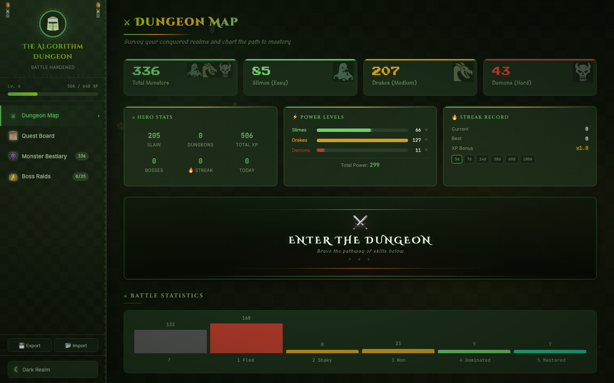
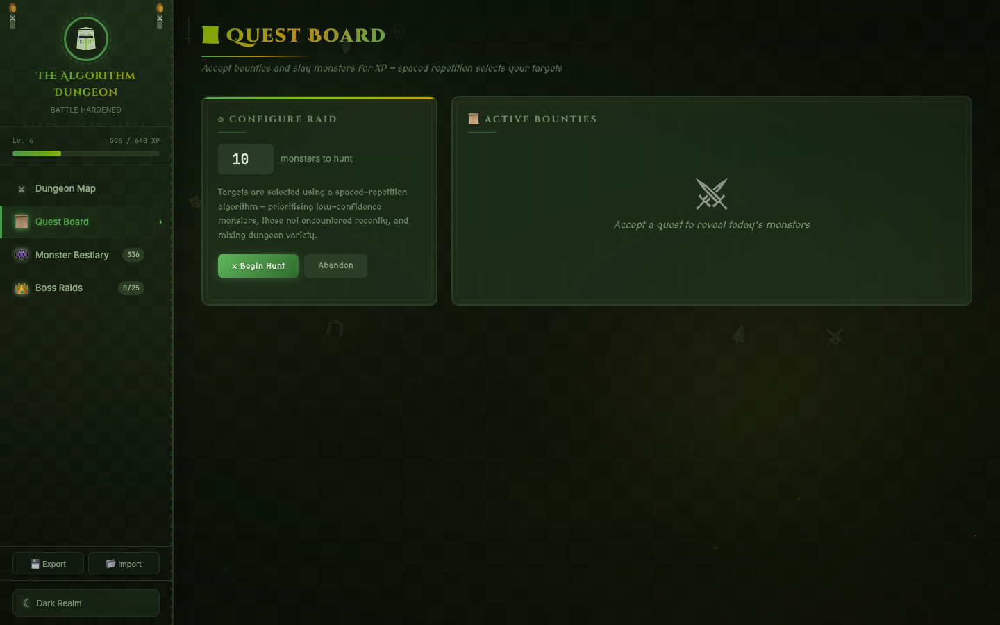
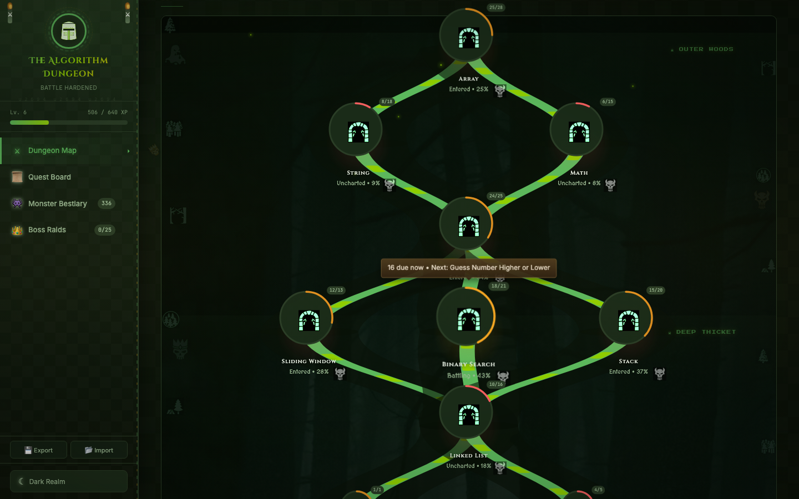

# DSA Dojo

A gamified DSA (Data Structures & Algorithms) practice tracker that turns LeetCode problem-solving into an RPG adventure. Problems are monsters, topics are dungeons, and mastery is earned through battle.

**[Live Site](https://heyiamhemant.github.io/DSA_Dojo/)**

## Preview

| Dashboard | Quest Board |
|:-:|:-:|
|  |  |

| Bestiary | Dungeon Pathway |
|:-:|:-:|
|  |  |

## Features

- **Dungeon Pathway** — A branching forest-themed map that visualizes your progression through DSA topics, from fundamentals like Arrays and Strings up to advanced topics like Graphs and Dynamic Programming.
- **Quest Board** — A spaced-repetition engine that generates daily quests. It prioritizes overdue reviews over new problems and gates difficulty progression (no Hard problems until you've built a foundation in Easy and Medium).
- **Bestiary** — A filterable, sortable table of all 336 tracked problems with difficulty, topic, confidence level, and next review due date.
- **Power Levels** — Interactive per-difficulty power bars showing which monsters you've slain. Click to expand and see individual problem details.
- **XP & Leveling** — Earn XP scaled by difficulty and confidence. Level up through ranks from Wanderer to Mythic Champion.
- **Streak Tracking** — Consecutive review days earn XP multipliers. Milestone rewards at 3, 7, 14, 30, and 60-day streaks.
- **Boss Raids** — A separate System Design section with its own encounter tracking.
- **Export / Import** — Save and restore all progress as JSON.
- **Dark & Light Mode** — Full theme support with a forest/dungeon aesthetic.

## Run Locally

No build step needed — everything is in a single self-contained HTML file.

```bash
# Clone
git clone https://github.com/heyiamhemant/DSA_Dojo.git
cd DSA_Dojo

# Open
open index.html        # macOS
xdg-open index.html    # Linux
start index.html       # Windows
```

Or just open `index.html` in any browser.

## Tech

Single-file HTML application (~300KB) with inline CSS, JavaScript, and embedded problem data. No frameworks, no dependencies, no server required. Uses `localStorage` for persistence and external assets from Google Fonts and game-icons.net.

## Credits

Problem set sourced from [Leetcode_interesting_repo](https://github.com/heyiamhemant/Leetcode_interesting_repo).
